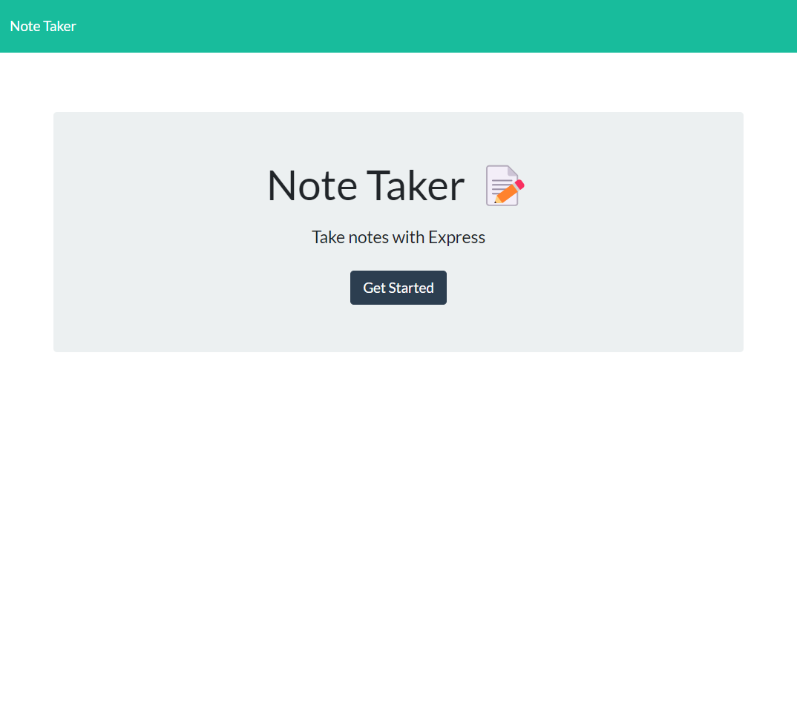
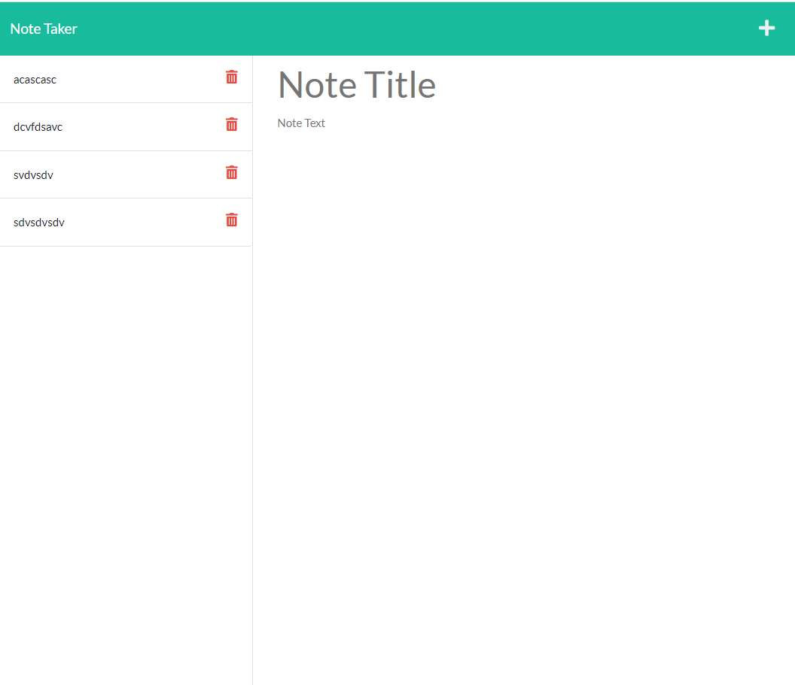
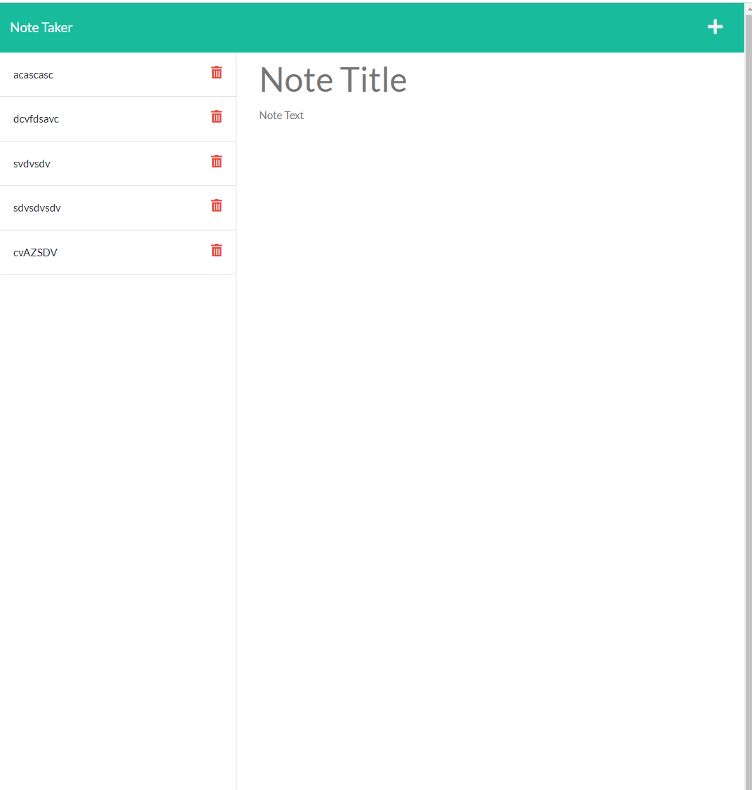

# Note Taker 

    
    Use will be able to write notes and save it into the server. 
    User can view it anytime.
## Table Contents
  - [Installation](#installation)
  - [Usage](#usage)
  - [Contributing](#contributing)
  - [Test](#test)
  - [Question](#question)

## Installation
    User have no need to install this app. just follow the link on test section

## Usage
    Javascript
    HTML
    CSS
    Node.js
    Express.js
    Insommia
    MDN resources
   

## Contributing
    User can send email on what user want to improve to question section below. 

## Test

- link: [https://serene-woodland-59945.herokuapp.com](https://serene-woodland-59945.herokuapp.com)
- gitHubLink: [https://github.com/Phacharapol18/NoteTaker-with-express](https://github.com/Phacharapol18/NoteTaker-with-express)

## Question
- [phacharapol18](https://github.com/phacharapol18)
- <a href = "mailto:phacharapol18@gmail.com" target = "_blank">phacharapol18@gmail.com</a>
### Thank you
    